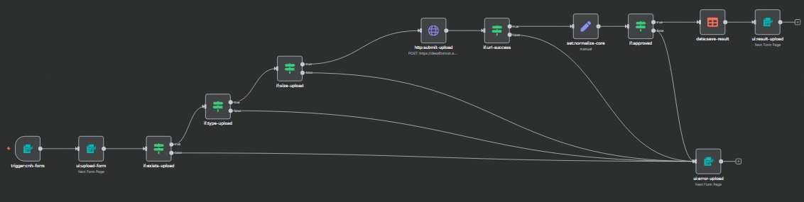
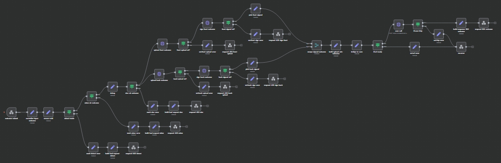
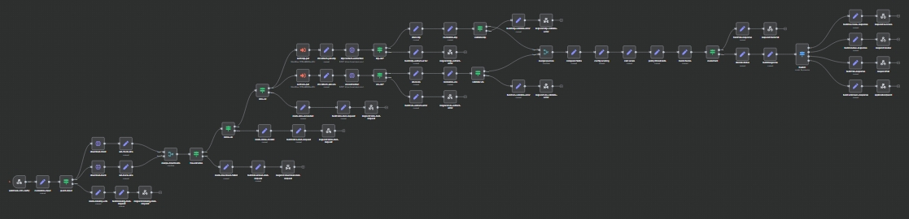

# CNH Validation System: Documentação Técnica e Funcional

## 📘 Visão Geral

O sistema de **validação de CNH (Carteira Nacional de Habilitação)** foi desenvolvido em **n8n**, com o objetivo de permitir que um usuário envie fotos da frente e do verso da CNH através de uma interface simples.  
Essas imagens são processadas, armazenadas no **Supabase** com URLs assinadas e então analisadas pelo **Core**, responsável por extrair e validar os dados do documento.

O projeto é composto por **três fluxos principais**:

1. **validation-cnh-ui (UI):** Formulário que é a interface de entrada do usuário.  


2. **upload-img-to-url (upload + Supabase):** fluxo de recepção e geração das URLs das imagens.  


3. **Core (validação e extração):** processamento, extração de dados e resposta final.


---

## 🧩 Estrutura dos Workflows

### 1. **Fluxo UI – `validation-cnh-ui`**

#### 📋 Objetivo
Gerar a interface que o usuário final interage.  
Permite o upload das imagens, faz validações básicas e mostra a resposta (sucesso ou erro).

#### 🔁 Etapas principais
| Etapa | Nó | Função |
|-------|----|--------|
| 1 | `trigger:cnth-form` | Inicia o fluxo de upload via formulário. |
| 2 | `ui:upload-form` | Exibe campos para upload da frente e verso da CNH. |
| 3 | `if:exists-upload` | Garante que os dois arquivos foram enviados. |
| 4 | `setphoto-fields` | Define campos de referência (`frontFile` e `backFile`). |
| 5 | `http:submit-upload` | Envia as imagens para o fluxo **welcome** via webhook. |
| 6 | `if:url-success` | Verifica se o retorno das URLs foi bem-sucedido. |
| 7 | `data:save-result` | Persiste os dados extraídos (resposta do core). |
| 8 | `ui:result-upload` | Exibe a resposta formatada ao usuário. |
| 9 | `ui:error-upload` | Mostra mensagens amigáveis em caso de falha. |

#### 💬 Validações
- Verifica se o usuário enviou **frente e verso**.
- Verifica se os arquivos são de tipo válido (`jpg`, `jpeg`, `png`).
- Em caso de erro:
  - Exibe “Não foi possível processar suas imagens. Verifique se são fotos válidas da CNH.”  

#### 🧠 Resposta exibida ao usuário
| Campo | Descrição |
|--------|------------|
| **Status** | `Aprovado` ou `Reprovado` |
| **Motivo** | Explicação contextual (“Aprovado: score 1.00 ≥ 0.9”, “Imagem ilegível”, etc.) |
| **Dados** | Nome, CPF, Data de Nascimento, Filiation (pais), Local de Nascimento, Emissão, Validade, Categoria, Tipo de Habilitação. |

---

### 2. **Fluxo Welcome – `welcome-submit`**

#### 📋 Objetivo
Receber as imagens da UI, fazer upload no **Supabase Storage** e gerar URLs **assinadas** (com token temporário) para serem utilizadas pelo **Core**.

#### 🔁 Etapas principais
| Etapa | Nó | Função |
|-------|----|--------|
| 1 | `welcome-submit` | Recebe os arquivos via webhook. |
| 2 | `normalize-input` | Padroniza os nomes e garante um UUID único. |
| 3 | `guard-input` | Valida URLs e impede duplicações ou formatos incorretos. |
| 4 | `upload-front-welcome` | Envia imagem da frente para o Supabase. |
| 5 | `sign-front-welcome` | Gera URL assinada para a frente. |
| 6 | `upload-back-welcome` | Envia imagem do verso para o Supabase. |
| 7 | `sign-back-welcome` | Gera URL assinada para o verso. |
| 8 | `merge-signed-welcome` | Une as URLs assinadas em um único objeto. |
| 9 | `build-upload-urls-welcome` | Monta o payload que será enviado ao core. |
| 10 | `bridge-to-core` | Prepara e envia os dados para o **core principal** via `core-call`. |

#### 💾 Armazenamento Supabase
- **Bucket:** `cnh-uploads`
- **Path:** `front/<uuid>-front.jpg` e `back/<uuid>-back.jpg`
- As URLs assinadas são temporárias e seguras:
```

https://<SUPABASE_URL>/storage/v1/object/sign/cnh-uploads/front/<uuid>-front.jpg?token=<TOKEN>

````

#### 🧱 Exemplo de payload enviado ao Core
```json
{
"frontUrl": "https://.../front/123-front.jpg?token=...",
"backUrl": "https://.../back/123-back.jpg?token=...",
"source": "welcome"
}
````

---

### 3. **Fluxo Core – `cnh-validation-core`**

#### 📋 Objetivo

Extrair informações da CNH e validar os dados comparando as informações extraídas de duas fontes (IDP e VIO).

#### 🔁 Etapas principais

| Etapa | Nó                       | Função                                                 |
| ----- | ------------------------ | ------------------------------------------------------ |
| 1     | `idp:content-extraction` | Envia imagem para API de extração (IDP).               |
| 2     | `vio:extraction`         | Valida dados cruzados via OCR e modelo de verificação. |
| 3     | `merge:sources`          | Junta resultados IDP e VIO.                            |
| 4     | `build:success-response` | Estrutura o JSON final de resposta.                    |
| 5     | `respond:200-welcome`    | Retorna resultado ao fluxo **welcome**.                |

#### 🧠 Exemplo de resposta final

```json
{
  "reason": "Aprovado: score 1.00 ≥ 0.9.",
  "person": {
    "name": "ROBSON RODOLFO COUTO GOMES",
    "cpf": "777.333.444-22",
    "birth_date": "26/08/2000",
    "issue_date": "03/10/2025",
    "expiry_date": "11/07/2034",
    "birth_place": "RECIFE/PE",
    "mother_name": "MARIA GOMES",
    "father_name": "ROBERTO COUTO GOMES",
    "category": "A",
    "license_type": "D"
  }
}
```

#### ⚙️ Formatação automática

* Datas → formato `DD/MM/AAAA`
* CPF → formato `XXX.XXX.XXX-XX`

---

## ⚠️ Tratamento de Erros

| Situação          | Mensagem ao Usuário                                        | Ação Técnica                                  |
| ----------------- | ---------------------------------------------------------- | --------------------------------------------- |
| Upload incompleto | “Por favor, envie frente e verso da CNH.”                  | Redireciona para o início.                    |
| Imagem inválida   | “A imagem enviada não parece ser uma CNH válida.”          | Loga evento no `if:url-ready`.                |
| Timeout no Core   | “Erro de comunicação com o sistema. Tente novamente.”      | Requisição é abortada e status 400 retornado. |
| Falha no Supabase | “Erro ao salvar suas imagens. Tente novamente mais tarde.” | Executa `ui:error-upload`.                    |

---

## 🔐 Segurança e Armazenamento

* As imagens são temporariamente armazenadas no Supabase com URLs **assinadas** (expiram em ~5 minutos).
* Tokens são exclusivos por execução (`UUID` do fluxo).
* Nenhum dado sensível é armazenado permanentemente no n8n.

---

## 📄 Autor e Versão

**Versão:** 1.0.0

**Última atualização:** Outubro/2025

**Responsável técnico:** Rafael Alesson

**Ambiente:** n8n Cloud – Workflow Orchestration

